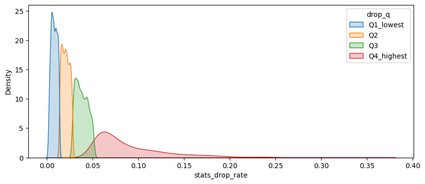
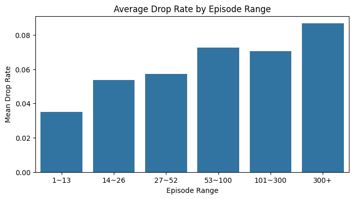

# 애니메이션 시청 데이터 vs. 중도 하차(drop rate)

#### 1. **프로젝트 개요**

- 분석 목적: 애니메이션 시청 데이터에서 **중도하차(drop rate)**에 영향을 미치는 요인을 탐색하여,
  애니 소비 패턴을 이해하고 특징을 파악한다.

- 데이터 출처 및 설명:
  - AniList GraphQL API 기반 크롤링
  - final dataset: df_final.parquet
  - numeric/ohe 정제본: df_clean_eda.parquet

#### 2. **데이터 기본 정보 확인**

- 총 데이터 수: 10000 rows
- 컬럼 수: 253개
- 주요 컬럼: `Target: stats_drop_rate` `stats_weighted_score` `popularity` `favourites` `episodes` `duration` `seasonYear` 등

#### 3. **기술 통계 및 데이터 요약**

- 수치형 변수: `NUMERIC_COLS`

| Statistic | stats_weighted_score | stats_drop_rate | averageScore | meanScore | popularity | favourites | episodes | duration |
| --------- | -------------------- | --------------- | ------------ | --------- | ---------- | ---------- | -------- | -------- |
| **count** | 10000.00             | 10000.00        | 9677.00      | 9701.00   | 10000.00   | 10000.00   | 9719.00  | 9672.00  |
| **mean**  | 67.31                | 0.0379          | 64.90        | 66.05     | 26290.73   | 637.20     | 13.42    | 30.70    |
| **std**   | 9.72                 | 0.0376          | 9.55         | 9.48      | 62319.93   | 2748.72    | 31.84    | 27.43    |
| **min**   | 10.00                | 0.0000          | 16.00        | 10.00     | 742.00     | 0.00       | 1.00     | 1.00     |
| **25%**   | 61.77                | 0.0127          | 59.00        | 61.00     | 1875.00    | 14.00      | 1.00     | 20.00    |
| **50%**   | 67.89                | 0.0268          | 65.00        | 67.00     | 5598.00    | 48.00      | 10.00    | 24.00    |
| **75%**   | 73.69                | 0.0491          | 71.00        | 72.00     | 21768.50   | 251.00     | 13.00    | 27.00    |
| **max**   | 95.05                | 0.3548          | 91.00        | 91.00     | 923138.00  | 89678.00   | 1787.00  | 168.00   |

- 범주형 변수: OHE 된 `tag_*` `genre_*` 등

#### 4. **결측치 및 이상치 탐색**

- `averageScore`: 점수가 없으면 비교 자체가 불가능이므로 모두 제거했음
- `status`: “NOT_YET_RELEASED” 일 경우, 아직 방영되지 않은 애니메이션이기 때문에 (타겟 라벨이 맞지 않음) 제거
- `seasonYear` `seasonInt` 등의 결측치들은 방영 정보가 불명확한 작품으로 대부분 확인됨. 제거했음.

#### 5. **변수 간 관계 분석**

- Spearman 상관계수 Heatmap:
  - `stats_drop_rate` - `episodes (+0.67)`, `averageScore (-0.37)`, `averageScore (-0.37)`

* `averageScore`의 각 구간별 `stats_drop_rate` 평균은 낮은 구간에서 드랍률이 상대적으로 높게 나타났다.

#### 6. **파생 변수 생성 및 전처리 제안**

- **`stats_drop_rate` 변환**  
  드랍률은 0~5% 구간에 대부분 몰려 있어 분포가 극단적으로 치우쳐 있다.  
  모델링 또는 시각화에서 분포 왜곡을 줄이기 위해 `log1p` 또는 `sqrt` 변환을 적용하는 것이 유효하다.  
  또한 분석 단계에서는 드랍률 분포를 4분위수 기준으로 구간화(`drop_q`)하여 그룹별 특성을 비교하였다.

- **`averageScore` 구간화(`score_bin`)**  
  평균 점수는 연속형 지표로 개별 작품 단위에서는 편차가 커 패턴 확인이 어려웠다.  
  따라서 최소값~최대값 기준 일정한 간격으로 나누어 점수대별 평균 드랍률을 계산하였다.  
  이 구간화는 점수와 드랍률 관계를 부드럽게 관찰하게 해주며, “점수가 낮을수록 드랍률이 높음”이라는 경향을 명확히 파악하는 데 도움이 된다.

#### 7. **요약 및 인사이트 도출**

1. **Drop Rate는 매우 낮고 극단적으로 치우친 분포**
   - 대부분 0~5% 구간에 밀집
   - 원본값만으로는 패턴 파악이 어려워 변환 또는 구간화가 필요하다.
   
   

2. **평균 점수(averageScore)는 Drop Rate와 뚜렷한 음의 상관**
   - 점수가 낮을수록 드랍률이 빠르게 상승
   - 점수는 가장 영향력 있는 예측 변수로 확인됨.
   

3. **회차 수(episodes)는 Drop Rate를 강하게 증가시키는 요인**
   - 회차가 많을수록 드랍률 상승
   - 특히 100화 이상 장편에서 중도 이탈이 크게 증가.
   

4. **인기(popularity, favourites)는 드랍률과 직접적 관계 없음**
   - 많이 찾는 작품이라도 중도 이탈은 점수·회차 영향이 더 큼.

5. **장르·태그는 드랍률을 설명하지 못함**
   - 장르/태그별로 드랍률 분포를 비교했지만 뚜렷한 차이가 나타나지 않았다.
   - 전체 장르/태그 OHE 총 200+ 개 중 대부분의 상관계수가 -0.03 ~ +0.03 사이
   - boxplot에서도 장르/태그 포함 여부에 따른 드랍률 차이는 거의 없음
   - 따라서 주제(theme)는 드랍률을 결정하는 요인이 아님이 시각적으로도 확인됨
   - 콘텐츠의 주제보다는 ‘작품 길이’와 ‘평점’이 드랍 행동을 좌우한다.
   